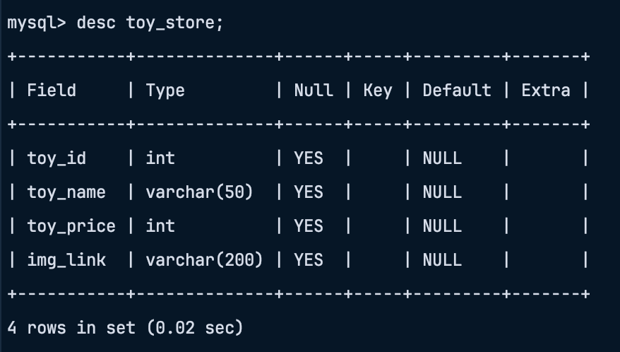

# RESTful_api_ToyStore

REST Api made by using backend framework `flask` in python.

- API supports all CRUD operations.
- Incorporates a public API tool Unsplash to dynamically generate thumbnails for each pet species during entry.
- Seamlessly interacts with a mysql database

### Database Structure:

